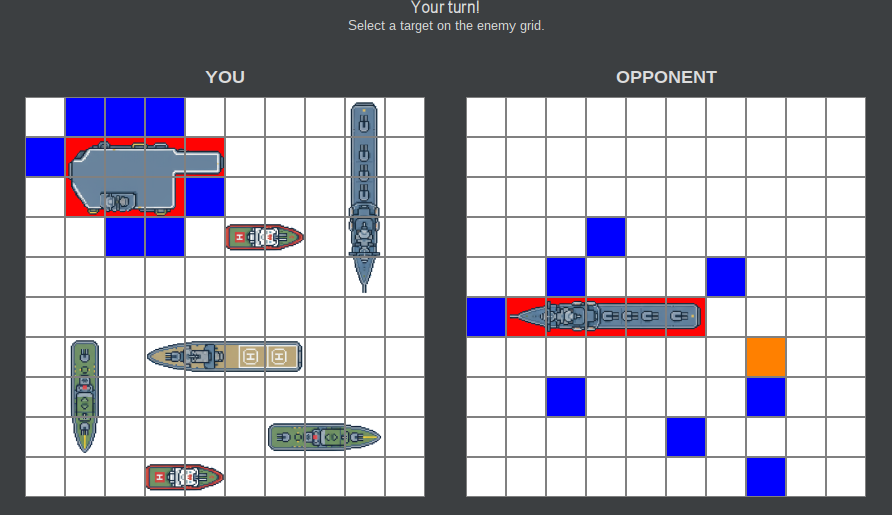
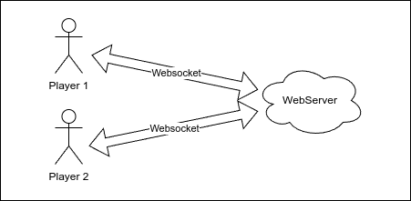
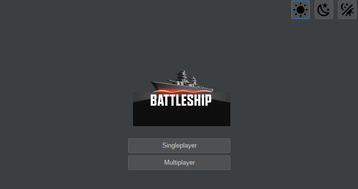

# Battleship Game

[Screenshot principale del gioco]

Battleship is a classic two-player strategy game where players take turns guessing the locations of each other's ships on a grid. The objective is to sink all of the opponent's ships before they sink yours.

This modern implementation features a full client-server architecture with also single player capabilities.

## Table of Contents
- [Features](#features)
- [Architecture](#architecture)
- [Prerequisites](#prerequisites)
- [Installation](#installation)
- [Usage](#usage)
  - [Running the Game Client](#running-the-game-client)
  - [Running the Server](#running-the-server)
- [Project Structure](#project-structure)
- [Technologies](#technologies)
- [Testing](#testing)
- [Configuration](#configuration)
- [Project Members](#project-members)

## Features

- 🎮 **Modern GUI**: Clean and intuitive graphical interface built with Java Swing and FlatLaf
- 🌓 **Light and Dark themes**: Automatically adapts to system dark/light mode
- 🌐 **Client-Server Architecture**: Multiplayer support through HTTP-based communication
- 📊 **Grid-Based Gameplay**: Classic battleship grid system with visual feedback
- 🔄 **Real-time Updates**: Live game state synchronization between clients



## Architecture

The project is organized into three main modules:

### 1. Common Module (`battleship-common`)
Core game logic and shared utilities:
- **Models**: `CellState`, `Coordinate`, `GameState`, `ShipType`, `Orientation`
- **Services**: `CommandLineService`, `PathManager`
- **Utils**: `Logger`, `GridMapper`, `Defaults`
- **Data structures**: Shared data models for client-server communication

### 2. Game Client Module (`game`)
GUI application for players:
- **View**: Welcome screen and game interface
- **Controller**: Game logic and user interaction handling
- **Client**: HTTP client for server communication
- **Serializers**: JSON serialization for network communication

### 3. Server Module (`server`)
Backend server for multiplayer games:
- **Web Server**: Javalin-based REST API
- **Routes**: Game session management endpoints
- **Models**: Server-side game state management
- **Implementation**: Game logic and session handling



# Prerequisites

- **Java**: JDK 25 or higher

## Installation

### Download Pre-built Binaries

1. Download the latest release from the releases page
2. Extract the JAR files:
   - `Battleship.jar` - Game client
   - `Battleship-Server.jar` - Game server

### Using the Gradle Wrapper

Clone the repository and use the included Gradle wrapper (no Gradle installation required):

```bash
git clone https://github.com/LucaFontanot/battleship-units.git
cd battleship-units
./gradlew shadowJar
```

On Windows:
```cmd
gradlew.bat shadowJar
```

Build artifacts will be located in:
- `game/build/libs/Battleship.jar`
- `server/build/libs/Battleship-Server.jar`

## Usage

### Running the Game Client

To start the game client GUI:

```bash
java -jar Battleship.jar
```

#### Command-Line Options (Client)

```bash
# Display help information
java -jar Battleship.jar --help

# Display version information
java -jar Battleship.jar --version
```



### Running the Server

To start the game server:

```bash
java -jar Battleship-Server.jar
```

#### Command-Line Options (Server)

```bash
# Display help information
java -jar Battleship-Server.jar --help

# Display version information
java -jar Battleship-Server.jar --version

# Specify custom port
java -jar Battleship-Server.jar --port 8080
```

## Project Structure

```
battleship/
├── common/                # Shared library module
│   ├── src/
│   │   ├── main/          # Main source code
│   │   └── test/          # Unit tests
├── game/                  # Client GUI application
│   ├── src/
│   │   ├── main/
│   │   │   ├── java/      # Client implementation
│   │   │   └── resources/ # UI resources
│   │   └── test/          # Client tests
├── server/                # Server application
│   ├── src/
│   │   ├── main/          # Server implementation
│   │   └── test/          # Server tests
│   └── build.gradle
└── build.gradle           # Root build configuration
```

## Technologies

### Core Technologies
- **Java 25+**: Primary programming language
- **Gradle**: Build automation and dependency management
- **Lombok**: Reduce boilerplate code with annotations

### Client Technologies
- **Swing**: GUI framework
- **FlatLaf**: Modern look and feel
- **jSystemThemeDetector**: Automatic theme detection
- **OkHttp**: HTTP client for server communication
- **IntelliJ Forms**: GUI designer integration

### Server Technologies
- **Javalin**: Lightweight web framework

### Shared Libraries
- **Apache Commons CLI**: Command-line argument parsing
- **Log4j2**: Logging framework
- **Gson**: JSON serialization

### Testing
- **JUnit**: Testing framework
- **Mockito**: Mocking framework for unit tests

## Testing

Run all tests:

```bash
./gradlew test
```

Generate test reports:

```bash
./gradlew test --tests "*"
```

Test reports are generated in `<module>/build/reports/tests/test/index.html`

## Configuration

### Logging

Log configuration is managed through `log4j2.xml` in each module's resources directory. 

Logs are stored in:
- Client: `${sys:programPath}/logs/system.log`
- Server: `${sys:programPath}/logs/system.log`

Log files are automatically rotated and compressed.

### Debug Mode

Enable debug logging starting the app with the `-d` flag.

## Game Rules

1. **Setup**: Each player places their ships on their grid
2. **Ships**:
   - 1 Carrier (5 cells)
   - 1 Battleship (4 cells)
   - 1 Cruiser (3 cells)
   - 2 Frigate (3 cells)
   - 2 Destroyer (2 cells)
3. **Turns**: Players alternate taking shots at opponent's grid
4. **Hit/Miss**: Visual feedback for successful and unsuccessful shots
5. **Victory**: First player to sink all opponent ships wins

## Project Members

This project was developed by:
- **Alexia Hincu**
- **Luca Fontanot**
- **Riccardo Pantanali**